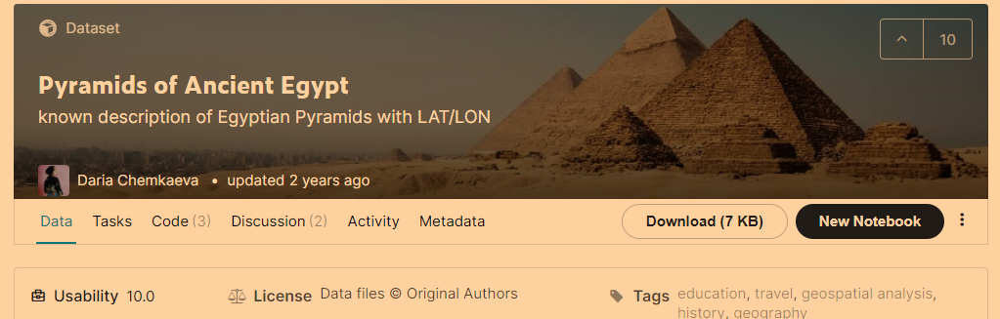
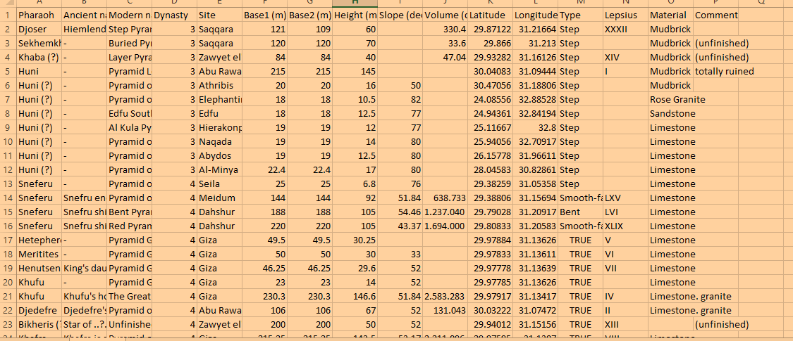
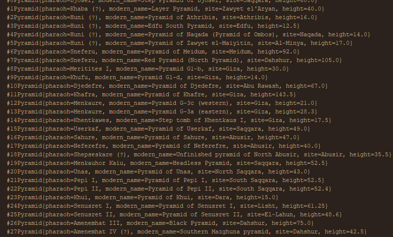

# Analysing pyramids dataset using Java

## Overview
This is a project to analyise pyramids dataset and show results in the java console 

## Used tools:

* Java basics
* Java OOP
* Kaggle datasets

To get the data set follow this link  [pyramids_dataset](https://www.kaggle.com/lsind18/egyptianpyramids).

## Made by:

This project is made by : Mohamed Nabil